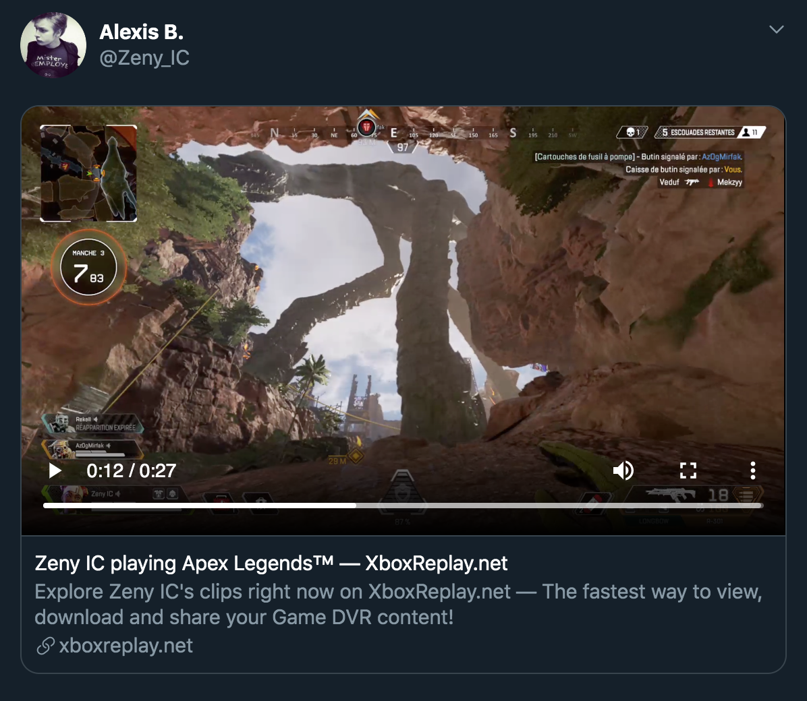

# Express UGC Proxy

Express middleware to proxy user-generated content to your own host and embed them on social media platforms such as Facebook, Twitter, Discord, etc.



### Installation

```
npm install @xboxreplay/express-ugc-proxy
```

### But, why?

Each user-generated content has an unique URI which is only valid for a few hours. If this URI is used and shared (via direct link or fetched by an external platform thanks to the meta tags) it may be cached and will become unreachable once expired. Or worse, blocked by default for security reasons (CORS policies).

The idea behind this proxy is to create an unique URI for each content and handle all the fetch, reload and even cache logic **(TBD)** inside it.

### Demo

A live demo is available [here](https://express-ugc-proxy-demo.xboxreplay.now.sh).

### Examples

**Important notice:** This proxy is inspired by the one used on [XboxReplay.net](https://www.xboxreplay.net/). The behavior is a bit different but performances are much better (for [reasons](https://i.redd.it/mgjvqsd2j8e31.jpg)).

* **Gameclip:** https://www.xboxreplay.net/ugc-files/clips/2535465515082324/d1adc8aa-0a31-4407-90f2-7e9b54b0347c/388f97c0-17bc-4939-a592-d43c365acc48/gameclip.mp4
* **Gameclip thumbnail (Small):** https://www.xboxreplay.net/ugc-files/clips/2535465515082324/d1adc8aa-0a31-4407-90f2-7e9b54b0347c/388f97c0-17bc-4939-a592-d43c365acc48/thumbnail-small.png
* **Screenshot (Large):** https://www.xboxreplay.net/ugc-files/screenshots/2535465515082324/d1adc8aa-0a31-4407-90f2-7e9b54b0347c/1f002a0d-6100-4976-b5c6-e3580b6bc061/screenshot.png

### Usage example

```
import express from 'express';
import UGCMiddleware from '@xboxreplay/express-ugc-proxy';
import XboxLiveAuth from '@xboxreplay/xboxlive-auth';

const app = express();

app.use('/ugc-files, UGCMiddleware.handle(
    XboxLiveAuth.authenticate('xbl-account@domain.com', '*********')
), { debug: true });

app.listen(8888, err => {
    if (err) console.error(err);
    else console.info('> Listening at http://127.0.0.1:8888');
});
```

Then navigate to http://127.0.0.1:8888/ugc-files/gameclips/2535465515082324/d1adc8aa-0a31-4407-90f2-7e9b54b0347c/388f97c0-17bc-4939-a592-d43c365acc48/gameclip.mp4

### Path composition

```
┌─────────────────────────────────────────────────────────────────────────┐
│      type     │     XUID     │     SCID     │     ID     │     name     │
└─────────────────────────────────────────────────────────────────────────┘
```

* Supported types: **gameclips** | **screenshots** (may be overridden, see options)
* Supported names *("gameclips" only)*: **gameclip.mp4**
* Supported names *("screenshots" only)*: **screenshot.png**
* Supported names *(common)*: **thumbnail-small.png** | **thumbnail-large.png**

### Parameters

* **XBLAuthenticateMethod** {Promise<{ XSTSToken: string, userHash: string }>} **See below**
* options {Object?}
    * **onRequestError** {Function?} **See below**
    * **fileTypesMapping** {Object?} *Used to override default file types*
        * gameclips? {string?}
        * screenshots? {string}
            * Example: { gameclips: 'clips' } Gameclips will be served from /clips/... instead of /gameclips/...
    * **debug** {boolean?} *Stdout the error and display its reason in response body*
    * **redirectOnFetch** {boolean?} *Skip the proxy phase and redirect to the media URI*

##### XBLAuthenticateMethod
This method must returns a Promise with a valid `XSTSToken` and an `userHash` which are used by the `@xboxreplay/xboxlive-api` module to fetch the targeted file. To prevent an authentication at each request wrap the `authenticate` method exposed by the `@xboxreplay/xboxlive-auth` module and its response inside a Promise and store / return its response as long it's valid.

Of course an in-memory data structure store as [Redis](https://www.npmjs.com/package/ioredis) is recommended for this kind of usage.

```
let XBLAuthorization = null;

const XBLAuthenticateMethod = () =>
    new Promise((resolve, reject) => {
        if (XBLAuthorization !== null) {
            const hasExpired =
                XBLAuthorization.expiresOn !== null &&
                new Date(XBLAuthorization.expiresOn) <= new Date();

            if (hasExpired === false) {
                return resolve({
                    XSTSToken: XBLAuthorization.XSTSToken,
                    userHash: XBLAuthorization.userHash
                });
            }
        }

        return XboxLiveAuth.authenticate('xbl-account@domain.com', '*********')
            .then(({ XSTSToken, userHash, expiresOn }) => {
                XBLAuthorization = { XSTSToken, userHash, expiresOn };
                return resolve({
                    XSTSToken: XBLAuthorization.XSTSToken,
                    userHash: XBLAuthorization.userHash
                });
            })
            .catch(reject);
    });

app.use('/ugc-files, UGCMiddleware.handle(
    XBLAuthenticateMethod
));
```

##### onRequestError
By default if something goes wrong the request will be closed and a HTTP status code will be returned to the client, including the error reason if the `debug` mode is enabled. A custom behavior is possible with this option.

```
const onRequestError = (details, res, next) => {
    const { statusCode, reason } = details;
    return res.redirect(`/my-error-page?code=${statusCode}&reason=${reason}`);
};

app.use('/ugc-files, UGCMiddleware.handle(
    XBLAuthenticateMethod
), { onRequestError });
```

### Proxy all the way?
As specified upper `redirectOnFetch` allows you to skip the proxy phase and redirect to the media URI. This case is recommended if you want to stream a media directly from Azure servers on your own website to prevent useless memory usage.

```
app.use('/redirect-ugc-files, UGCMiddleware.handle(
    XBLAuthenticateMethod
), { redirectOnFetch: true });

app.use('/stream-ugc-files, UGCMiddleware.handle(
    XBLAuthenticateMethod
), { redirectOnFetch: false });
```

### What's next?
* Add tests 🤷
* ~~Handle cache logic~~
* ~~Allow custom file types mapping~~
